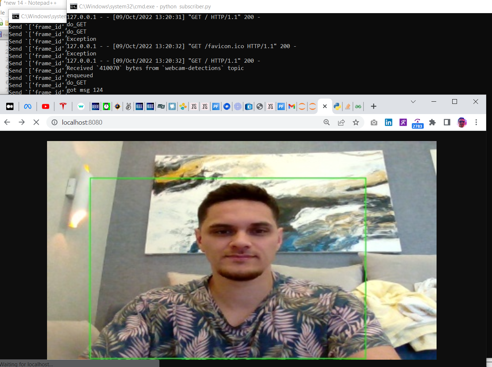

# My solution to the interview challenge at Samsung SAIC Cambridge 2022

[Total report PDF](./MLEng-challenge.pdf)

One task was to quantize a FasterRCNN trained model in PTQ style. I tried:
- Pytorch dynamic quantization
- ONNXRuntime quantization
- Pytorch Post-training quantization (PTQ)
- TensoRT PTQ
- float16 reduced precision
- Mixed float16/float32

The fun part of this challenge was to setup a MJPEG + bounding box metadata stream over MQTT.

Here is a screenshot of the Transmitter capturing the webcam stream and Receiver displaying it in real time:

